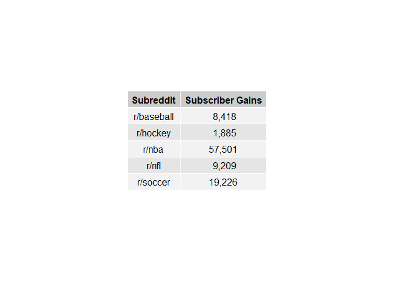

Subscriber gains
================

Package needed
--------------

``` r
library(dplyr)
library(gridExtra)
```

Loading data
------------

``` r
load("subreddit_activity.RData")
```

Processing data and creating table
----------------------------------

``` r
gains <- subreddit_data %>% 
  group_by(subreddit) %>% 
  summarize(minimum = min(subscribers),
            maximum = max(subscribers)) %>% 
  mutate(subs_gains = format(maximum - minimum, big.mark = ",")) %>% 
  select(subreddit, subs_gains) %>% 
  rename("Subreddit" = subreddit,
         "Subscriber Gains" = subs_gains)

# Exporting table
gains_table <- tableGrob(gains, rows = NULL)
grid.arrange(gains_table)
```


